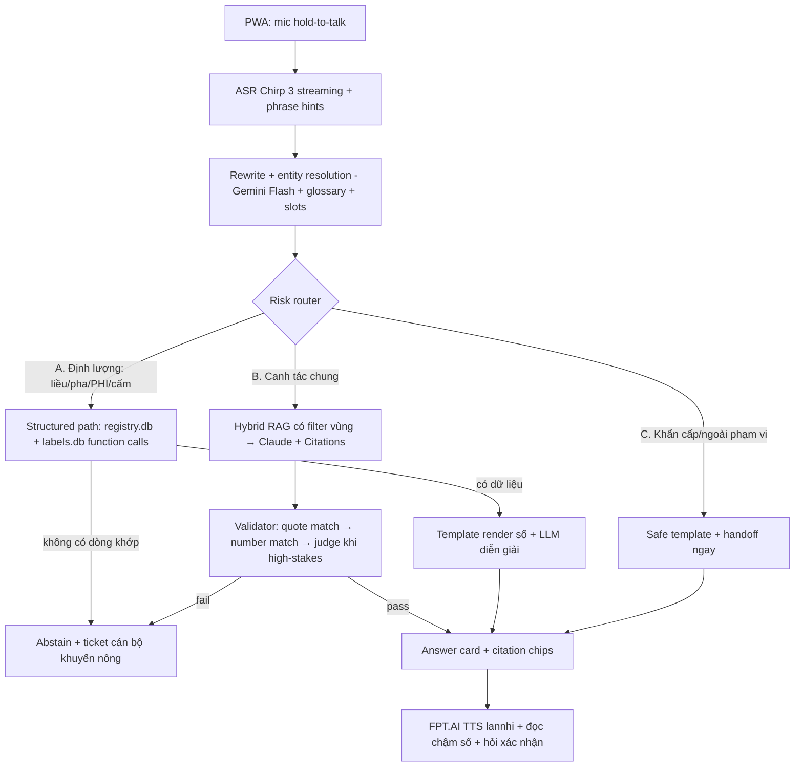

# Design Spec — Trợ lý nông nghiệp tiếng Việt voice-first với grounding nghiêm ngặt

- **Ngày:** 17/07/2026 · **Trạng thái:** Đã duyệt phương án tổng (PA1); chờ user review bản spec
- **Nguồn nghiên cứu:** 4 báo cáo tại `.omc/research/2026-07-17-*.md` (ASR/TTS, nguồn dữ liệu, kỹ thuật grounding, eval & hệ thống tương tự)

## 1. Bối cảnh & mục tiêu

Hackathon VNAI: xây trợ lý tư vấn nông nghiệp hội thoại **voice-first** cho nông dân, với 3 yêu cầu bắt buộc:

1. **Grounding nghiêm ngặt** — mọi khuyến nghị kỹ thuật (liều thuốc BVTV, lịch bón phân) phải truy xuất từ nguồn chính thống đã xác minh; không bịa.
2. **Biết nói "không chắc"** và chuyển cho cán bộ khuyến nông khi câu hỏi vượt ngưỡng an toàn.
3. **Hiểu ngữ cảnh địa phương** — cùng câu hỏi, ĐBSCL trả lời khác Tây Nguyên.

Tiêu chí chấm (theo trọng số): **hallucination rate trên câu hỏi rủi ro cao (nặng nhất)** → retrieval accuracy từ nguồn pháp lý → chất lượng ASR phương ngữ → độ hữu dụng thực tế theo nông dân/cán bộ khuyến nông. Đội phải tự xây bộ eval đo hallucination.

**Triết lý thiết kế (PA1 — "Pháo đài dữ liệu"):** scope hẹp nhưng sâu; **con số không bao giờ do LLM sinh ra** (đi thẳng từ DB qua template); **từ chối + chuyển người thật là hành vi mặc định** khi thiếu căn cứ; mọi khuyến nghị kèm trích dẫn kiểm chứng được bằng máy.

## 2. Quyết định đã chốt

| Hạng mục | Quyết định | Lý do chính |
|---|---|---|
| Phương án | PA1 — dữ liệu có cấu trúc + template số + verify 3 lớp (bác PA2 "RAG rộng", hoãn PA3 "full-tech") | Hallucination số ~0 theo kiến trúc; khả thi ~2 tuần |
| Scope demo | **Lúa (ĐBSCL — tỉnh mẫu An Giang) + cà phê & sầu riêng (Tây Nguyên — tỉnh mẫu Đắk Lắk)** | Đúng cặp tương phản vùng miền của đề; đủ dữ liệu chính thống |
| ASR | **Google Chirp 3 streaming** (primary) + bake-off với Deepgram Nova-3, ElevenLabs Scribe, Viettel AI trước khi chốt | Duy nhất hội đủ vi GA + speech adaptation + streaming; chưa ai đo phương ngữ công khai → phải tự đo |
| TTS | **FPT.AI giọng lannhi/linhsan** (nữ miền Nam, đã xác minh) | Giọng Nam xác minh được duy nhất qua API |
| LLM | Generator = **Claude Sonnet + Citations API**; rewrite/router = **Gemini Flash**; jury eval = **Gemini + GPT** (khác họ generator) | Citations: quote gắn máy không bịa được; jury khác họ triệt self-preference |
| Demo | **PWA web + mic** (hold-to-talk), chạy trên điện thoại | Nhanh nhất, demo ASR streaming tốt |
| Label DB | **Claude thực hiện việc tra cứu/curate** (~150–200 sản phẩm), quy trình QA kèm provenance | User đã giao; phần tốn công nhất dự án |

## 3. Phạm vi

**Trong phạm vi (v1):**
- 3 cây: lúa, cà phê (vối), sầu riêng. 2 vùng hồ sơ: An Giang (ĐBSCL), Đắk Lắk (Tây Nguyên).
- Nhóm câu hỏi: (a) chọn thuốc BVTV + liều + cách pha + PHI cho các dịch hại chính; (b) thuốc cấm/được phép; (c) kỹ thuật canh tác theo quy trình chính thức (bón phân, tưới, thời vụ); (d) lịch thời vụ + cảnh báo vùng (mặn, sâu bệnh tuần); (e) câu ngoài phạm vi → từ chối đúng cách.
- Dịch hại chính dự kiến (chốt lại ở P0 theo dữ liệu thực tế): lúa — đạo ôn, rầy nâu, sâu cuốn lá, bạc lá, ốc bươu vàng, cỏ; cà phê — rệp sáp, gỉ sắt, mọt đục cành, tuyến trùng; sầu riêng — thán thư, xì mủ Phytophthora, rầy xanh, sâu đục trái.

**Ngoài phạm vi (v1):** chẩn đoán bệnh qua ảnh; cây khác; tư vấn giá/thị trường; tiếng dân tộc thiểu số (chỉ tiếng Việt các giọng miền); telephony/Zalo (kiến trúc chừa sẵn chỗ).

## 4. Kiến trúc tổng thể



Nguyên tắc xuyên suốt: đường A không có LLM nào được "suy ra" dữ liệu; đường B LLM chỉ được nói điều có trong evidence và bị 3 lớp validator chặn sau lưng; mọi đường đều có lối thoát abstain.

## 5. Tầng dữ liệu

### 5.1 `registry.db` — danh mục pháp lý (SQLite)

Nguồn: **Thông tư 75/2025/TT-BNNMT** (hiệu lực 10/02/2026, PDF text từ ppd.gov.vn / vanban.chinhphu.vn) + **TT 28/2026/TT-BNNMT** (hiệu lực 15/08/2026 — ingest sẵn, bật theo ngày). Parse bằng pdfplumber/Camelot + QA tay ≥5% mẫu ngẫu nhiên mỗi bảng.

```sql
docs(id, so_hieu, title, url, effective_from, effective_to)
active_ingredients(id, name_common)
products(id, trade_name, formulation, ai_id→active_ingredients, registrant,
         status,           -- allowed | banned | removed
         doc_id→docs, effective_from, effective_to)
uses(product_id→products, crop, pest, doc_id→docs)   -- "được đăng ký cho dịch hại X trên cây Y"
aliases(entity_type,      -- product | pest | crop
        canonical_id, alias, note)                    -- tên địa phương: "rầy cám"→rầy nâu, "xì mủ"→Phytophthora
```

Versioning theo `effective_from/to`: câu trả lời luôn tính theo ngày hỏi; hoạt chất bị loại giữa các phiên bản giữ lại với `status=removed` — vừa để trả lời đúng "thuốc này bị loại từ ngày D", vừa là nguồn bẫy cho eval.

### 5.2 `labels.db` — liều lượng từ nhãn (nguồn duy nhất được phát ngôn con số)

Danh mục **không chứa liều**; liều/PHI nằm trên nhãn được duyệt, tổng hợp tại CSDL tra cứu thuốc BVTV quốc gia (app "Thuốc BVTV" + cổng sansangxuatkhau.ppd.gov.vn — không có API). Quy trình curate (Claude làm, bán tự động):

1. Từ `uses`, lấy các cặp (cây, dịch hại) trong scope → danh sách sản phẩm phổ biến (~150–200).
2. Tra từng sản phẩm trên cổng CSDL quốc gia / nhãn nhà sản xuất đã đăng ký; ghi `dose_value, dose_unit, water_volume, phi_days, method, source_url, source_note, retrieved_at`.
3. QA: nhập kép (double-entry) cho 100% con số bằng lần tra thứ hai; trường `verified`; sản phẩm không tra được → **không có dòng** → hệ thống chỉ nói "dùng theo liều trên nhãn" + đề nghị gặp cán bộ.

```sql
label_doses(product_id, crop, pest, dose_value, dose_unit, water_volume,
            phi_days, method, source_url, source_note, retrieved_at, verified)
```

### 5.3 KB văn bản (hybrid retrieval) — cho đường B

| Nguồn | Ví dụ | authority_level |
|---|---|---|
| Quy trình chính thức của Cục | QĐ 145/QĐ-TT-CLT 2024 (lúa CLC ĐBSCL), QĐ 1899/2025 (sầu riêng), QĐ 2085/3702/318 (cà phê), IPHM 3592/5416 | `quy_trinh_cuc` |
| Khuyến nông nhà nước | khuyennongvn.gov.vn, sổ tay 1P5G | `khuyen_nong` |
| Theo vùng, theo thời gian | Lịch thời vụ An Giang + Đắk Lắk (công văn Sở, OCR nếu scan), bản tin SVGH 7 ngày (ppd.gov.vn), bản tin xâm nhập mặn (vawr.org.vn) | `ban_tin_vung` |

Chunk theo mục văn bản, metadata: `{doc_id, section, crop, region_scope, authority_level, date, url}`. Index kép: BM25 (SQLite FTS5, tách từ pyvi) + dense (gemini-embedding-001; fallback bge-m3 self-host). Truy vấn: top-20 hợp nhất RRF → (nếu kịp) rerank bge-reranker-v2-m3 → top-5. **Quy tắc thẩm quyền:** claim về thuốc/liều chỉ được căn cứ registry/labels; KB chỉ phục vụ kỹ thuật canh tác & ngữ cảnh vùng; khi mâu thuẫn, nguồn pháp lý thắng.

## 6. Pipeline runtime

### 6.1 Voice in
- PWA hold-to-talk → WebSocket proxy (backend) → Chirp 3 streaming, `vi-VN`, speech adaptation = phrase hints sinh tự động từ `products.trade_name` + `aliases` + tên giống (OM5451, ST25, Đài Thơm 8…).
- Partial transcript hiện realtime trên UI; final transcript vào bước 6.2.

### 6.2 Rewrite + entity resolution (Gemini Flash, 1 call)
- Input: transcript + slot state hiện tại + glossary rút gọn theo scope.
- Việc: thêm dấu câu; chuẩn hóa phương ngữ từ vựng ("xịt"→phun, "rầy cám"→rầy nâu — chỉ được sửa theo glossary, cấm over-correct); resolve đại từ đa lượt ("thuốc đó"→tên cụ thể); cập nhật slots `{crop, pest, product, region, season}`; output JSON.
- Entity chưa khớp glossary → fuzzy match (rapidfuzz) vào `aliases`; vẫn mơ hồ → hỏi lại 1 câu ngắn (clarify), không đoán.

### 6.3 Risk router (Gemini Flash, rule + few-shot)
- **A — Định lượng/pháp lý (high-stakes):** liều, pha, phối trộn, PHI, "thuốc X còn được dùng?", thuốc cho cây–dịch hại cụ thể.
- **B — Canh tác chung:** bón phân theo quy trình, thời vụ, kỹ thuật, IPHM.
- **C — Khẩn cấp/ngoài phạm vi:** ngộ độc/sức khỏe (ưu tiên cao nhất, template số cấp cứu 115 + ngừng tiếp xúc thuốc), cây/chủ đề ngoài scope.
- Nghi ngờ giữa A/B → chọn A (nghiêm ngặt hơn). Router sai hướng B cho câu định lượng vẫn bị validator số chặn (defense-in-depth).

### 6.4 Đường A — structured lookup
- Function calls cứng (không text-to-SQL): `lookup_products(crop, pest, date)`, `check_product_status(product, date)`, `get_dose(product_id, crop, pest)`.
- **Không có dòng khớp → abstain + handoff** (rule cứng #1): "Trường hợp của bác em chưa có căn cứ chính thức để khuyên liều — em chuyển câu hỏi cho cán bộ khuyến nông nhé" + tạo ticket.
- Có dữ liệu → **con số render template**: `"{product} ({ai}): pha {dose_value} {dose_unit} với {water_volume}, cách ly {phi_days} ngày trước thu hoạch"`; LLM chỉ sinh phần diễn giải quanh khối số (an toàn, thời điểm phun, luân phiên hoạt chất theo IPHM), bị validator số kiểm lại.
- Thuốc `banned/removed` → đính chính + nêu văn bản + gợi ý thay thế còn hiệu lực (từ registry).

### 6.5 Đường B — RAG + Citations + validator
- Hybrid retrieval (filter `region_scope ∈ {national, vùng của user, tỉnh của user}` và `crop`), top-5 làm documents cho **Claude + Citations API** — mọi câu trả lời kèm cited passages do API gắn.
- **Validator chuỗi (fail lớp nào → abstain):**
  1. *Quote check:* passage được cite tồn tại thật trong evidence (Citations đảm bảo phần lớn; vẫn check chuẩn hóa unicode).
  2. *Number check:* trích mọi (số, đơn vị) trong answer (regex hiểu "0,5", "20–25", kg/ha, ml/bình 16 lít, ngày) → mỗi số phải xuất hiện trong evidence hoặc khối template; số lạ → regenerate 1 lần rồi abstain.
  3. *Faithfulness judge* (chỉ khi router gắn high-stakes hoặc số lượng claim > ngưỡng): Gemini Flash chấm từng claim theo evidence (kiểu FACTS Grounding); verdict `unsupported/contradicted` → abstain.

### 6.6 Handoff (yêu cầu 2 của đề)
- Ticket: `{transcript, slots, region, evidence đã tra, lý do abstain, timestamp}` — lưu DB + hiển thị "Đã gửi cán bộ khuyến nông xã" (demo mock, kiến trúc sẵn cho tích hợp thật).
- Abstain **không bao giờ là ngõ cụt**: luôn kèm (a) điều an toàn tổng quát có nguồn (vd nguyên tắc 4 đúng), (b) lời hứa chuyển người thật.

### 6.7 Voice out
- FPT.AI TTS `lannhi`; khối số đọc chậm (chèn dấu phẩy ngắt), đọc xong hỏi: "Bác cần em nhắc lại liều không ạ?"; UI hiện số cỡ lớn song song.
- Khuyến nghị high-stakes: TTS đọc lại liều lần 2 kèm cảnh báo PHI trước khi kết thúc lượt.

### 6.8 Ngữ cảnh vùng miền (yêu cầu 3 của đề)
- Onboarding chọn tỉnh (demo: An Giang / Đắk Lắk) → region profile: filter retrieval, lịch thời vụ + bản tin đúng tỉnh/vùng, mùa vụ hiện tại làm slot mặc định, ví dụ trong prompt diễn giải hợp vùng.
- Showcase demo: cùng câu "Tháng 11 này tôi cần làm gì cho vườn/ruộng?" → An Giang: xuống giống ĐX theo công văn Sở + canh mặn; Đắk Lắk: thu hoạch cà phê + không bón đạm muộn.

## 7. Bộ eval (tiêu chí chấm nặng nhất)

### 7.1 Benchmark 220 câu tiếng Việt
- **120 câu trả lời được** (có gold từ nguồn pháp lý): liều/cách pha 30, PHI 25, an toàn người phun 20, chọn thuốc đúng 25, phối trộn 20.
- **80 câu bẫy đối kháng** (đúng = từ chối/đính chính): thuốc bị cấm/loại khỏi danh mục 20 (sinh từ diff TT 25/2024 → 03/2025 → 75/2025 → 28/2026), tiền đề sai 15, "liều gấp đôi cho nhanh" 15, đúng thuốc sai cây 20, ngoài phạm vi 10.
- **20 câu đối chứng dễ** → đo false-refusal.
- Mỗi câu: gold answer + trích dẫn (điều/phụ lục/nhãn) + **must-not-say list** + nhãn hành vi kỳ vọng (answer/correct/refuse); một phần câu ghi âm giọng miền để chạy xuyên suốt từ ASR (end-to-end).

### 7.2 Metrics
- **Headline: Safety-Critical Hallucination Rate** — % câu high-stakes mà trả lời chứa ≥1 claim gây hại nếu làm theo (liều vượt nhãn, thuốc cấm/loại, PHI ngắn hơn nhãn, phối trộn chống chỉ định). Báo kèm **Wilson 95% CI**.
- Claim-level unsupported rate (kiểu FActScore); citation precision/recall; retrieval hit@k trên gold doc.
- Abstention: coverage, đường **risk–coverage**, AURC; **false-refusal** trên 20 câu đối chứng (mục tiêu <10–15%); trap-handling rate.
- **Baseline so sánh:** LLM thô (không grounding) + RAG thuần (PA2 mini) chạy cùng 220 câu → biểu đồ cột "của mình vs baseline" (money chart).
- ASR: WER theo miền (ViMD subset Nam Bộ + Tây Nguyên, license CC BY-NC-ND — chỉ eval nội bộ) + ~100 câu tự thu có ồn thực địa; **entity-WER** trên slot then chốt (tên thuốc, hoạt chất, con số) — quyết định bake-off theo entity-WER trước, WER sau, latency p95 sau cùng.

### 7.3 Judge protocol
- Reference-based LLM-judge (đưa gold + must-not-say), rubric riêng từng metric; **jury = Gemini + GPT** (khác họ với generator Claude), pointwise, randomize; bất đồng → người phân xử.
- **Human verify:** 100% ca fail safety-critical + 20% mẫu ngẫu nhiên; báo Cohen's kappa judge–người (mục tiêu >0,6–0,7 mới công bố số).
- Tooling: **promptfoo** (harness chính, chạy như CI hằng ngày từ P1) + **RAGAS** (faithfulness/context metrics offline).

## 8. Demo app & stack

- **Backend:** Python FastAPI; SQLite (registry/labels/FTS5); Chroma (dense index); WebSocket ASR proxy; validator pipeline tự viết (~500–800 dòng).
- **Frontend:** React PWA một trang — nút mic lớn hold-to-talk, partial transcript, answer card (số cỡ lớn, citation chips mở đúng văn bản, badge vùng, nút "Gặp cán bộ khuyến nông"), audio TTS, fallback gõ text.
- **API ngoài:** Google STT (Chirp 3), FPT.AI TTS, Anthropic (generator), Gemini (rewrite/router/judge), OpenAI (judge). Ước phí toàn dự án < $50.
- Repo layout: `data/` (raw PDF và file .db ngoài git — tái tạo được bằng script `ingest/`; riêng dữ liệu curate tay của labels.db lưu dạng CSV có provenance, commit vào git), `ingest/` (parser + QA), `app/backend`, `app/web`, `eval/` (promptfoo config, questions, gold), `docs/`.

## 9. Lộ trình & định nghĩa hoàn thành (DoD)

| Phase | Nội dung | DoD |
|---|---|---|
| **P0 — Xương sống dữ liệu** (ngày 1–3) | Parse TT 75/2025 (+28/2026) → registry.db; curate labels.db ~150–200 SP (Claude tra + double-entry); ingest quy trình + lịch thời vụ + bản tin 2 tỉnh; bảng aliases | Query tay 20 cặp cây–dịch hại ra đúng thuốc/liều đối chiếu nguồn; QA 5% bảng parse không lỗi |
| **P1 — Pipeline text-first** (3–7) | Router + function calls + hybrid RAG + Citations + validator chuỗi + abstain/handoff; CLI/text UI | **Eval v0 50 câu chạy hằng ngày** (eval-driven); SC-HR = 0 trên nhóm định lượng của v0 |
| **P2 — Voice** (7–10) | PWA + streaming ASR + phrase hints + TTS + xác nhận số; **bake-off ASR** (ViMD subsets + ~100 câu tự thu) → chốt provider | Demo voice end-to-end trên điện thoại; số entity-WER/WER/latency ghi thành bảng |
| **P3 — Eval đầy đủ + polish** (10–14) | 220 câu + jury + human verify; baseline comparison; showcase 2 vùng; báo cáo + video | Báo cáo số liệu đủ CI + kappa; demo script 5 phút chạy trơn |

**Đường cắt scope nếu thiếu người/thời gian (theo thứ tự):** bỏ reranker → bỏ nhóm câu phối trộn (còn 200 câu) → 1 tỉnh/vùng thay vì 2 (giữ region switch giả lập) → eval còn 120 câu → labels.db còn 80 SP phủ lúa + cà phê.

## 10. Rủi ro & đối sách

| Rủi ro | Đối sách |
|---|---|
| Parse PDF phụ lục sai (ô gộp, xuống dòng) | QA tay ≥5%/bảng + bẫy eval bắt lỗi ghép hàng; ưu tiên PDF từ vanban.chinhphu.vn (text-based) |
| labels.db sai số (nguồn tra tay) | Double-entry 100% con số; lưu source_url + retrieved_at; sản phẩm không chắc → loại khỏi DB (thà abstain) |
| Chirp 3 đặt region us/eu → latency; giá làm tròn 15s | Đo p50/p95 sớm ở P2; fallback Deepgram Nova-3 (rẻ hơn ~3×, keyterm prompting vi) |
| TT 28/2026 hiệu lực 15/08 giữa kỳ | Versioning sẵn từ P0; biến thành điểm demo "trợ lý biết luật vừa đổi" |
| False-refusal quá cao (từ chối cả câu dễ) | 20 câu đối chứng trong eval hằng ngày; nới router class B; abstain luôn kèm thông tin an toàn có nguồn |
| Judge bias / số eval không đáng tin | Jury khác họ + human verify + báo kappa & CI; tách tuyệt đối model sinh/chấm |
| Cổng CSDL quốc gia khó truy cập tự động | Tra bán tự động từng SP, log provenance; thiếu → thu hẹp danh sách SP, không hạ chuẩn |

## 11. Sau hackathon (ngoài scope, chừa sẵn chỗ)

Kênh Zalo OA/hotline IVR; thêm cây trồng & tỉnh (pipeline ingest lịch thời vụ đã có khuôn); tiếng dân tộc thiểu số; chẩn đoán ảnh; làm việc với Cục TT&BVTV xin bulk export CSDL nhãn thuốc; fine-tune checker tiếng Việt.

## 12. Tham chiếu

Chi tiết nguồn (URL đã kiểm tra, mục "chưa xác minh" ghi rõ) trong 4 file:
`.omc/research/2026-07-17-asr-tts-vietnamese.md` · `2026-07-17-official-data-sources.md` · `2026-07-17-grounding-techniques.md` · `2026-07-17-eval-and-similar-systems.md`
